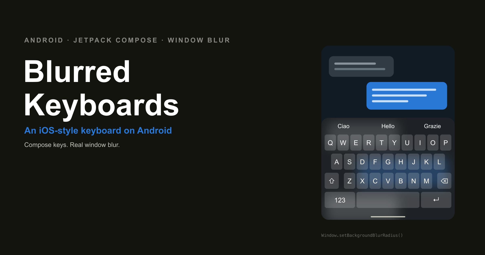
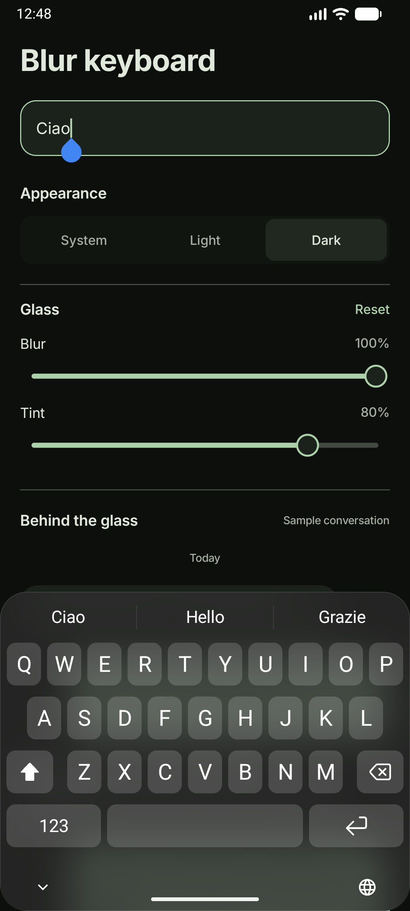

# Blur keyboard



An Android keyboard with a blurred background, built with Jetpack Compose. The companion app lets
you change the blur strength, tint and appearance while scrolling a sample conversation behind the
keyboard.

The keyboard layout is based on the iOS 27 reference. Android handles the blur and navigation
controls; the result is not an exact reproduction of Apple's rendering.

<p align="center">
  
</p>

## Run

Use JDK 21 and Android SDK 37.

```sh
./gradlew :app:assembleDebug
adb install -r app/build/outputs/apk/debug/app-debug.apk
```

Open **Blur IME Sample**, enable the keyboard, then select it. The app opens the playground when
both steps are complete.

On an emulator with a hardware keyboard attached, enable **Show on-screen keyboard** in Android
settings.

## Requirements

- Android 8 or later.
- Android 12 or later for background blur, with device support.
- Android 14 or later for the app's dynamic colour palette.

Blur support is detected automatically. The sample uses Android's window blur API when available, an
optional Samsung adapter on supported firmware, and an opaque background otherwise. It does not
require Shizuku, root or network access.

Both controls cover 0–100%. Blur maps to a 0–40dp radius. Reset restores 55% blur and 52% tint.

## Project structure

| Package        | Purpose                                                          |
|----------------|------------------------------------------------------------------|
| `ime`          | Keyboard layout, service, lifecycle and blur adapters            |
| `ui`           | Setup and playground screens, with their screen-specific helpers |
| `designsystem` | Theme, typography and shared Foundation components               |

`Settings.kt` holds the appearance and blur preferences beside `MainActivity`.

`MainActivity` connects the theme, preferences and screens. The app uses dynamic system colours
where available. The keyboard keeps its separate light/dark material palette.

## Tests

```sh
./gradlew :app:assembleDebugAndroidTest :app:lintDebug
adb install -r app/build/outputs/apk/androidTest/debug/app-debug-androidTest.apk
adb shell am instrument -w io.github.lucf15.blurkeyboard.test/androidx.test.runner.AndroidJUnitRunner
```

Device tests cover setup, typing, deletion, suggestions, theme changes, slider endpoints and
scrolling. Tests temporarily select the sample keyboard and restore the previous selection
afterward.

## Scope

This is an article sample, not a full keyboard replacement. Suggestions and conversation messages
are fixed sample content. It has no prediction engine, swipe typing, dictation, emoji panel or
long-press alternatives.
